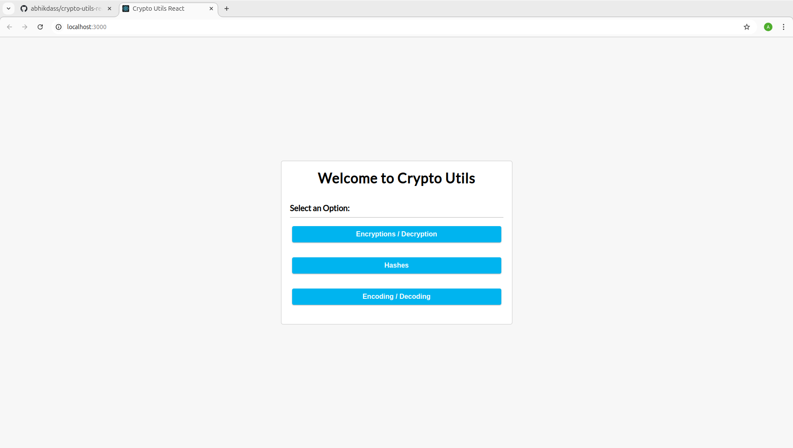
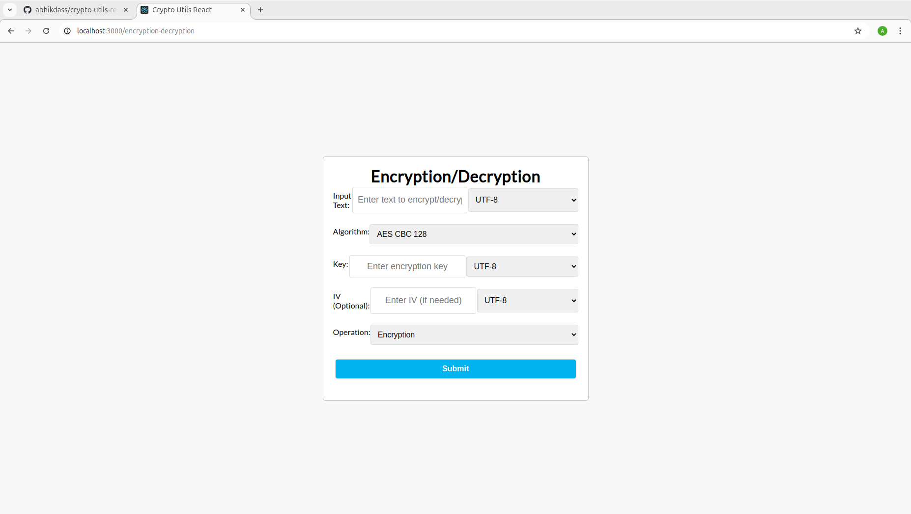

# Crypto Utils React

A web-based application for encoding/decoding, hashing, and encryption/decryption utilities. This project is built using React, with support for AES, DES, Base64, Hex, and other cryptographic and encoding methods.

## Features

- **Encryption/Decryption**: Supports AES and DES in multiple modes (CBC, ECB) with key and IV input options.
- **Hashing**: Hash your input using SHA-256, SHA-1, or MD5.
- **Encoding/Decoding**: Convert between UTF, Base64, Hex, and Binary formats.

## Table of Contents

- [Installation](#installation)
- [Usage](#usage)
- [Features](#features)
- [Screenshots](#screenshots)
- [Technologies](#technologies)
- [Contributing](#contributing)
- [Contact](#Contact)

## Installation

1. Clone the repository:
    ```bash
    git clone https://github.com/abhikdass/crypto-utils-react.git
    ```

2. Navigate into the project directory:
    ```bash
    cd crypto-utils-react
    ```

3. Install the dependencies:
    ```bash
    npm install
    ```

4. Start the application:
    ```bash
    npm start
    ```

The application should now be running at [http://localhost:3000](http://localhost:3000).

## Usage

Once you run the app, you can access different functionalities via the homepage. There are three main sections:

1. **Encryption/Decryption**: Input the text, select the algorithm, key format, and optional IV.
2. **Hashes**: Generate a hash from your input using different hashing algorithms.
3. **Encoding/Decoding**: Easily convert your data between different formats like Base64, Hex, UTF, and Binary.

## Screenshots

*Add screenshots of your app here*

For example:



## Technologies

This project is built with:

- **React**: A JavaScript library for building user interfaces.
- **Tailwind CSS**: Utility-first CSS framework for styling the application.
- **CryptoJS**: A library for performing cryptographic operations like AES, DES, and hashing.
- **Webpack**: Module bundler for JavaScript.
- **Babel**: JavaScript compiler to ensure compatibility across browsers.

## Contributing

We welcome contributions to enhance the functionality of this project. If you'd like to contribute, please follow these steps:

1. Fork the repository.
2. Create a new branch for your feature or bugfix.
3. Make your changes.
4. Commit your changes.
5. Push to your fork and submit a pull request.

## Contact

If you have any questions, suggestions, or feedback, feel free to reach out via email:

**Email**: [dasabhik35@gmail.com](mailto:dasabhik35@gmail.com)

I would be happy to connect and discuss any improvements or collaborations.
